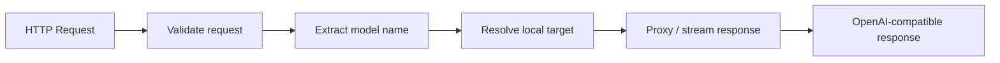

# Local API Gateway

**Local API Gateway** 是应用进入 BurnCloud Node 的稳定入口。

```text
http://localhost:3000/v1
```

它解决的问题很简单：应用不应该关心模型具体运行在哪个内部端口、由哪个 Runtime 启动，也不应该因为本地模型实现变化而修改接入代码。

## 用户看到什么

应用继续使用 OpenAI-compatible API，例如：

```bash
curl http://localhost:3000/v1/chat/completions \
  -H "Content-Type: application/json" \
  -d '{
    "model": "deepseek-r1-7b",
    "messages": [{"role":"user","content":"Hello"}]
  }'
```

## Gateway 负责什么



最小职责包括：

- 监听稳定本地地址；
- 兼容 `/v1/models`、`/v1/chat/completions` 等核心接口；
- 解析请求中的模型名；
- 把请求交给已经准备好的本地模型 Runtime；
- 代理普通响应与流式响应；
- 把内部 Runtime 错误转换成稳定的 Node API 错误。

## Gateway 不负责什么

Gateway 本身不应该承担模型下载、硬件选择或 Runtime 安装逻辑。

```text
Gateway
  ├─ 接收请求        ✓
  ├─ 解析模型        ✓
  ├─ 转发 / streaming ✓
  ├─ 下载 GGUF       ✗ → Model Manager
  ├─ 判断 VRAM       ✗ → Hardware Detection
  └─ 启动 llama.cpp  ✗ → Runtime / Process Manager
```

## 稳定接口与内部接口

外部稳定接口：

```text
localhost:3000/v1
```

内部目标可以是动态的：

```text
127.0.0.1:39122
127.0.0.1:39123
...
```

这些内部端口只属于 Node 实现细节，不应该暴露给应用。

## 状态

Gateway 至少需要区分：

```text
READY
MODEL_PREPARING
MODEL_UNAVAILABLE
RUNTIME_UNHEALTHY
NODE_ERROR
```

当模型还未准备好时，Gateway 应返回明确的模型准备状态，而不是让用户看到一个无法理解的连接失败。

## 当前源码 / 目标

- **✅ Current**：BurnCloud 当前已经有统一 `/v1` 数据面与 Router 请求链。
- **🎯 Node v0.1**：把统一数据面进一步连接到本地 Model Resolver 和本地 Runtime 生命周期。

真实现有接口与调用链继续参考 Technical Reference 中的 **HTTP / API → AI API / Data Plane**。
