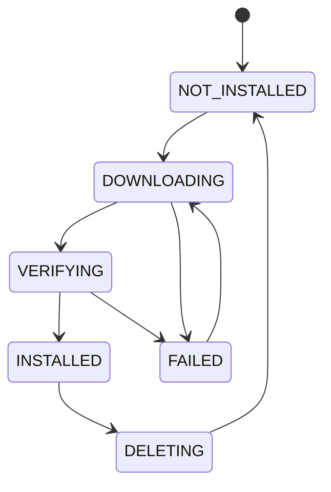

# Model Manager

**Model Manager** 管理 BurnCloud Node 本地的模型 Artifact 生命周期。

它接收 Model Resolver 已经选好的 `ResolvedModel`，负责把对应文件可靠地准备到本机。

## 最小职责

```text
download
resume
verify checksum
cache
list
delete
status
```

## 模型目录

建议从 Node v0.1 开始固定本地目录结构：

```text
~/.burncloud/
├── models/
├── runtimes/
├── cache/
├── logs/
└── state/
```

模型 Artifact 不应该散落在应用目录里。

## 生命周期



## 下载行为

Model Manager 至少需要保证：

- 支持断点续传；
- 同一 Artifact 不重复下载；
- 下载完成后做 checksum 校验；
- 临时文件和正式文件分开；
- Node 重启后可以恢复未完成任务；
- 下载失败不会留下一个被误认为可用的模型文件。

## 并发请求

当多个请求同时触发同一个模型准备时：

```text
Request A ─┐
Request B ─┼─► one model preparation job
Request C ─┘
```

不能为同一个 Artifact 启动多份下载。

## Model Manager 与 Resolver 的边界

```text
Model Resolver
  决定“要哪个文件”
       ↓
Model Manager
  确保“这个文件在本地可靠存在”
```

Model Manager 不重新决定量化版本，也不直接启动推理进程。

## 状态接口

对 Node 内部应能查询：

```json
{
  "model": "deepseek-r1-7b",
  "variant": "gguf-q4-k-m",
  "status": "downloading",
  "progress": 43,
  "bytes_downloaded": 3512000000,
  "bytes_total": 8170000000
}
```

Gateway 可以基于这份状态向用户报告 `MODEL_PREPARING`。

## 失败情况

必须明确区分：

```text
NETWORK_ERROR
DISK_FULL
CHECKSUM_MISMATCH
ARTIFACT_NOT_FOUND
PERMISSION_DENIED
DOWNLOAD_INTERRUPTED
```

## 当前源码 / 目标

- **✅ Current**：BurnCloud 已有下载基础设施、进度监控和不完整下载恢复相关代码。
- **🎯 Node v0.1**：把下载基础设施收敛成面向本地模型 Artifact 的统一 Model Manager，并与 Resolver / Runtime Manager 建立清晰接口。
