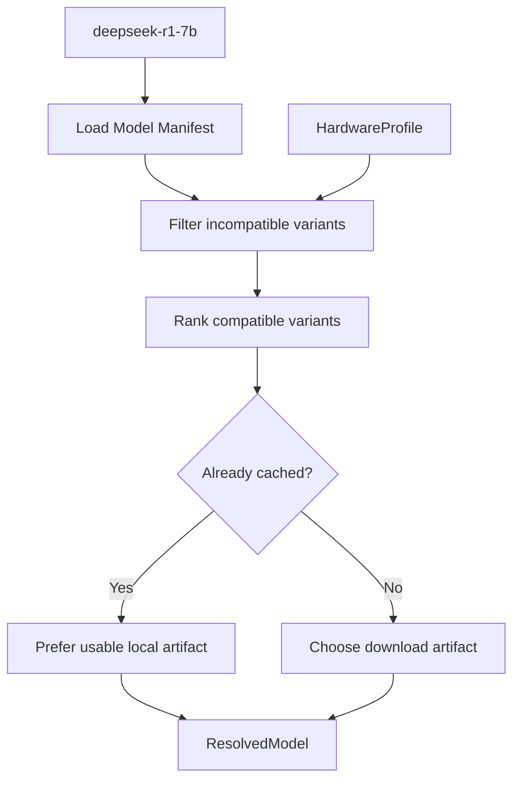

# Model Resolver

**Model Resolver** 负责把用户请求中的稳定模型名，解析成当前机器真正应该使用的模型 Variant 和 Artifact。

用户写的是：

```text
deepseek-r1-7b
```

而不是：

```text
DeepSeek-R1-Distill-Qwen-7B-Q4_K_M.gguf
```

这就是 BurnCloud Node 的核心原则之一：

> **Request a model, not a file.**

## Resolver 的输入与输出

输入：

```text
Model name
+
HardwareProfile
+
Runtime capabilities
+
Local model state
```

输出：

```text
ResolvedModel
├─ canonical model id
├─ runtime
├─ format
├─ quantization / variant
├─ artifact URI
├─ checksum
└─ resource requirements
```

## 解析流程



## Model Manifest

目标 Manifest 可以描述多个实现版本：

```yaml
name: deepseek-r1-7b
variants:
  - id: gguf-q4-k-m
    runtime: llama.cpp
    format: gguf
    quantization: q4_k_m
    min_ram_gb: 8
    recommended_vram_gb: 8
    artifact: ...

  - id: gguf-q8-0
    runtime: llama.cpp
    format: gguf
    quantization: q8_0
    min_ram_gb: 16
    recommended_vram_gb: 12
    artifact: ...
```

## Resolver 不应该做什么

它只做“选择”，不做“执行”。

```text
选择 Variant       ✓
判断兼容性          ✓
输出 Artifact       ✓

真正下载文件        ✗ → Model Manager
启动 Runtime        ✗ → Runtime Manager
管理 PID            ✗ → Process Manager
```

## 选择原则

Node v0.1 首先追求**可运行和可解释**，而不是做复杂的黑盒优化。

建议最初按以下优先级：

```text
1. 必须满足硬件最低要求
2. 已缓存且可用的 Variant 优先
3. Runtime 已准备好的 Variant 优先
4. 在资源允许范围内选择推荐质量
5. 无兼容 Variant 时明确返回原因
```

## 无法解析时

Resolver 需要返回结构化原因，例如：

```text
NO_MODEL_MANIFEST
NO_COMPATIBLE_VARIANT
INSUFFICIENT_RAM
INSUFFICIENT_VRAM
UNSUPPORTED_RUNTIME
ARTIFACT_UNAVAILABLE
```

这为以后进一步 fallback 到 Private Network 或 BurnCloud Network 留出统一接口。

## 当前源码 / 目标

- **🎯 Node v0.1**：Model Resolver 是新的本地 Node 核心抽象。
- 当前 Source Atlas 中的 `ModelRouter` 解决的是现有上游 Channel / Provider 路由问题，不应和本地 `Model Resolver` 混成同一个职责。
