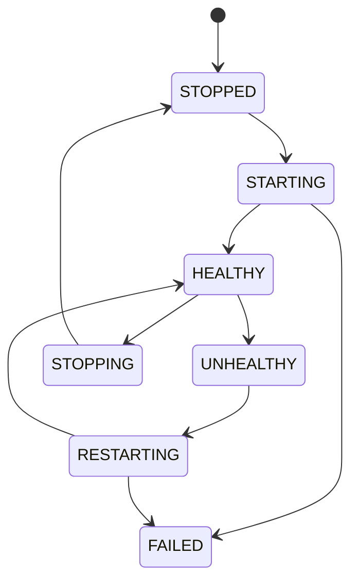

# Process Manager

**Process Manager** 负责真正运行起来的模型进程。

Runtime Manager 决定“怎么启动”，Process Manager 负责“启动以后怎么管”。

## 需要管理的运行状态

```text
model
runtime
PID
internal port
started_at
health
restart_count
log path
```

例如：

```text
deepseek-r1-7b
Runtime: llama.cpp
PID: 18282
Port: 39122
Status: HEALTHY
```

这个内部端口不会暴露给应用。应用始终访问：

```text
localhost:3000/v1
```

## 生命周期



## 启动完成不等于 Ready

Process Manager 不应该只看到“进程创建成功”就认为模型可用。

正确流程：

```text
spawn process
    ↓
PID created
    ↓
wait for health endpoint / readiness signal
    ↓
HEALTHY
    ↓
Gateway may route requests
```

这样可以避免模型还在加载权重时请求已经被转进去。

## 崩溃与恢复

进程意外退出时至少记录：

- exit code；
- 最后健康状态；
- restart count；
- stderr / log location；
- 是否允许自动重启。

自动重启必须有上限，避免错误配置进入无限 crash loop。

```text
restart 1
restart 2
restart 3
   ↓
FAILED / manual intervention
```

## 多模型

Node 未来可以同时管理多个模型进程：

```text
BurnCloud Node
├── deepseek-r1-7b → :39122
├── qwen3-8b       → :39123
└── llama-3-8b     → :39124
```

Gateway 根据模型名路由到对应内部目标。

Node v0.1 不必优先追求大量模型常驻，可以先实现可靠的单模型/少量模型生命周期。

## 失败情况

```text
PROCESS_SPAWN_FAILED
PROCESS_EXITED
READINESS_TIMEOUT
HEALTH_CHECK_FAILED
PORT_CONFLICT
RESTART_LIMIT_REACHED
```

## 当前源码 / 目标

- **🎯 Node v0.1**：形成专门面向本地模型 Runtime 的进程状态管理。
- Process Manager 不应该和桌面 UI 生命周期绑定；Headless Server 和 Desktop Node 应共享同一套核心进程管理逻辑。
