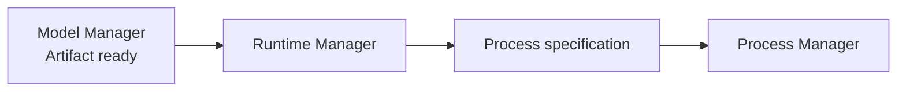

# Runtime Manager

**Runtime Manager** 管理“如何运行模型”的推理引擎，而不是管理模型文件本身。

Node v0.1 建议先把 Runtime 范围控制得很小：优先跑通 **GGUF + llama.cpp**，再扩展其它 Runtime。

## Runtime 抽象

目标接口可以保持简单：

```text
prepare()
start()
stop()
health()
```

以后不同实现统一挂到同一个抽象下：

```text
Runtime
├── LlamaCppRuntime   ← Node v0.1 priority
├── VllmRuntime       ← future
└── SglangRuntime     ← future
```

## prepare()

负责确认 Runtime 可以运行：

- 当前 OS / architecture 是否支持；
- Runtime binary 是否存在；
- 版本是否满足要求；
- GPU backend 是否兼容；
- 需要的动态库是否可用。

如果不存在，则由 Runtime Manager 准备对应版本，而不是要求用户自己安装完整开发环境。

## start()

启动时输入的是已经准备好的模型 Artifact 和运行参数：

```text
ResolvedModel
+
Artifact path
+
HardwareProfile
+
Runtime options
        ↓
Runtime process specification
```

Runtime Manager 负责生成正确的启动方式，但实际 PID 和进程健康由 Process Manager 跟踪。

## Runtime 与模型解耦



同一个模型名未来可能存在多个 Runtime 实现，因此 Model Resolver 应输出 Runtime 要求，而不是把 llama.cpp 写死在 API Gateway 中。

## 版本管理

Runtime 也需要版本概念：

```text
runtime_id
version
platform
architecture
backend
checksum
install_path
```

升级 Runtime 时不应该破坏已有模型缓存。

## 失败情况

需要区分：

```text
RUNTIME_NOT_AVAILABLE
RUNTIME_UNSUPPORTED_PLATFORM
GPU_BACKEND_UNAVAILABLE
RUNTIME_VERSION_MISMATCH
START_CONFIGURATION_INVALID
```

## 当前源码 / 目标

- **🎯 Node v0.1**：建立统一 Runtime Manager，并优先完成 llama.cpp 生命周期。
- 第一版不建议同时支持 llama.cpp、vLLM、SGLang、TensorRT-LLM 等多个 Runtime，否则会让 Node MVP 的测试矩阵过大。
